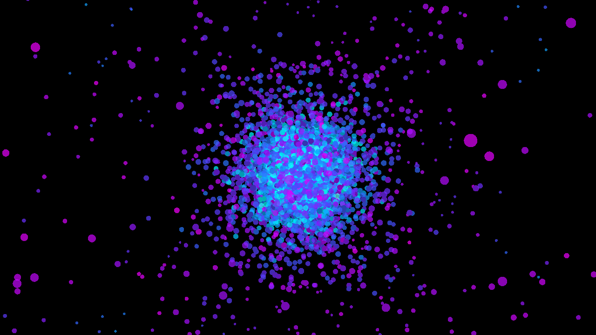

# Introduction
<span></span>

`physim` is a versatile pipeline-based framework for running N-Body simulations. At its core, `physim` creates a system composed of entities and the state of the system is evolved through modular components at regular timesteps. On each timestep, the state of the system is rendered. `physim`'s functionality come from plugins. These plugins provide components which let users customise how:
- entities are created
- forces are calculated
- numerical integration is performed
- the system is rendered

For example, you may want to simulate a globular cluster with 10,000 stars. You can compose how your system evolves through configuring which elements will be used in your simulation.

```bash
# simulation of a plummer sphere with gravity
physim global dt=0.01 iterations=1000! plummer n=10000 ! \
    astro theta=0.3 e=0.02  ! rk4 ! glrender

# add collisions
physim global dt=0.01 iterations=1000! plummer n=10000 ! \
    astro theta=0.3 e=0.02 ! collisions ! rk4 ! glrender

# make everything act like a there's also a spring connecting 
# it to the centre of the universe
physim global dt=0.01 iterations=1000! plummer n=10000 ! \ 
    astro theta=0.3 e=0.02 ! shm ! collisions ! rk4 ! glrender
```

If you are interested in studying the universe through simulation, then I'd recommend using more well established software for your domain (e.g. [NEMO](https://github.com/teuben/nemo)). However, if you want to have fun and render [cool videos](https://youtube.com/playlist?list=PLLBNbi9sF5y4QUUCJiiEdBRob6bNU1Nki&si=K7VPk8XlheiKU7oB), then `physim` might be suit your needs.

The first chapter will focus on how to use `physim` to run simulations and how to render videos. The second chapter will give an example of how a plugin can be made with Rust. 
